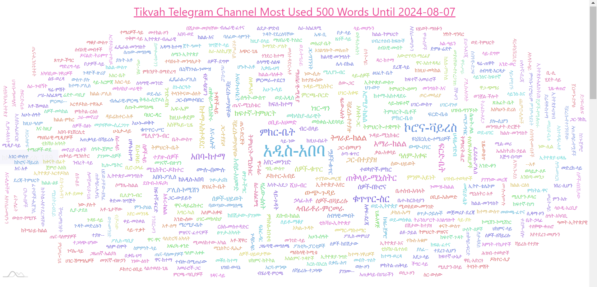

# [Tikvah](https://t.me/s/tikvahethiopia) Telegram channel analysis repo
! this repo analysis is done for **learning purpose**

## one of analysis dashboard


### another


### libraries used
- bs4

### clone repo
```bash
git clone https://github.com/hmhard/tikvah-tg-channel-analysis.git
```

### run the following commands 

```bash
# give permission
chmod +x process.sh
```

```bash
# default 500 given to top n change to whatever you want
./process.sh 500
```

### Preprocessing Steps Completed:

- Fetched HTML data.
- Extracted data into JSON format.
- Filtered Amharic keywords, removing entries with:
  - Emojis
  - English characters
  - Special characters
  - Numbers
- Filtered out stop words.


## final data be like

```bash
 data = {
    "ሰዎች": 14109,
    "ከተማ": 10457,
    "ክልል": 9968,
    "ቤት": 8725,
    "አበባ": 7661,
    "ሲሆን": 7288,
    "ዛሬ": 6636,
    "መሆኑን": 6383,
    "ተማሪዎች": 5937,
    "ቀን": 5896,
    "ከፍተኛ": 5741,
    "የኢትዮጵያ": 5684,
    "ሰዓት": 5294,
    "ፖሊስ": 5167,
    "እንዲሁም": 5136,
    "መንግስት": 4997,
    "ትምህርት": 4992,
    "መረጃ": 4845,
    "ስራ": 4820,
    "ብር": 4673,
    "ኢትዮጵያ": 4528,
    "ቫይረስ": 4229,
    "ደግሞ": 4185,
    "ቁጥር": 4154,
    "ሚኒስትር": 4130,
    "አገልግሎት": 4026,
    "ዞን": 3999,
    "ዩኒቨርሲቲ": 3820,
    "ዓመት": 3709,
    ...
```

## you can also do extra processing and analysis and create pull request.
---

## if you like this repo, please give it the star.